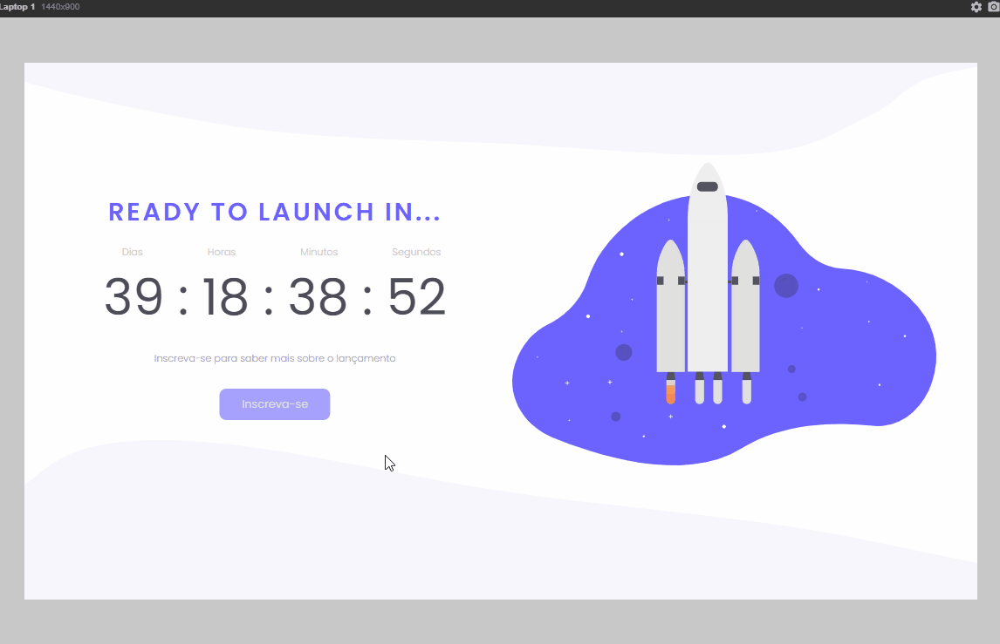
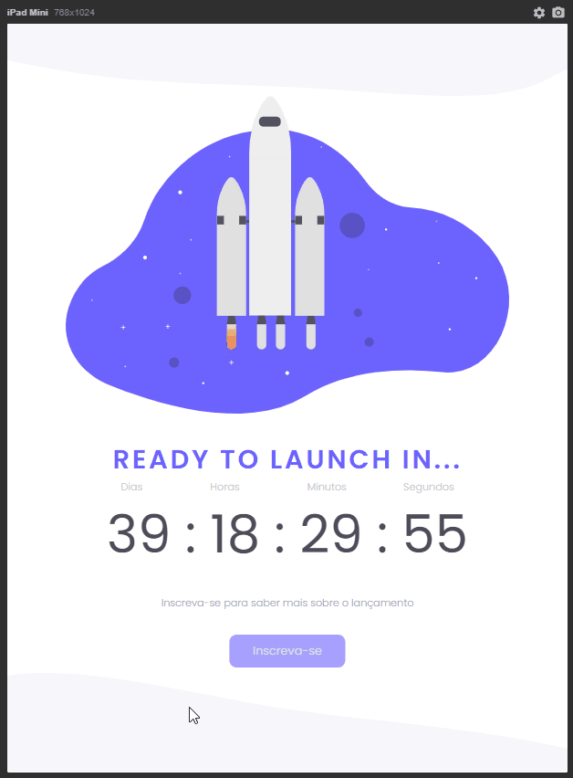
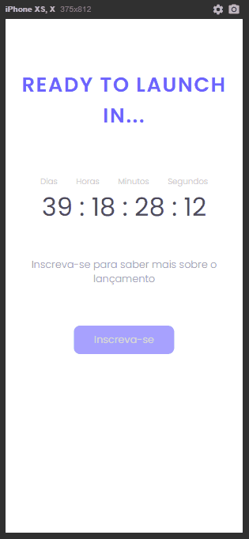

# Discover_Desafio_Countdown

## A countdown web site to promote something new

	<a href="#computer-about">About</a> •
 	<a href="#art-layout">Layout</a> • 
 	<a href="#clipboard-how-to-use">How to use</a> • 
 	<a href="#rocket-technologies">Tech Stack</a> • 
 	<a href="#dart-author">Autor</a> • 
 	<a href="#memo-license">License</a>

### :computer: About

In this challenge, it was requested to create a page in the "coming soon style" for the launch of a website, product or service.  
The page should display a countdown timer telling you how much time is left, using only:

-   HTML
-   CSS
-   Javascript

As a "extra mile" it was sugest to implement a simple modal form, when the user click in subscribe buttom.

After that I finished the desktop project, to challenge myself I decided to implement and apply the media queries, to build a mobile and tablet version.

---

### :art: Layout

### Desktop

	

### Tablet and Mobile

	
	

---

### :clipboard: How To Use

To execute in your local machine:

STEP 1. Just click in buttom "Code" and download.

STEP 2. Extract all files and open the file "index.html" with you favorite browser.

---

### :rocket: Technologies

---

### :dart: Author

	Made with &#128150 by Daniel Padovani &#128075 Entre em contato! 	

  
  

---

### :memo: License

This project is under the MIT license. See the [LICENSE](link/master/LICENSE) for more information.
